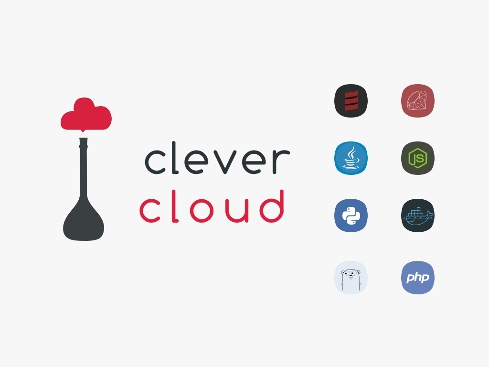

% Why PostgreSQL deserves NoSQL fans' respect
% Clément Delafargue
% NoSQL matters - 2015-03-26

-------------------------------------------

# I'm online!

 - [\@clementd](https://twitter.com/clementd) on twitter
 - [cltdl.fr/blog](https://cltdl.fr/blog)
 - [clever cloud](http://clever-cloud.com)

-------------------------------------------



-------------------------------------------

<p style="text-align:center">
<br><br>
<span style="font-size: 5.5em;">λ</span>
</p>

-------------------------------------------

<p style="text-align:center">
<br><br>
<span style="font-size: 5.5em;">Scala</span>
</p>

-------------------------------------------

<p style="text-align:center">
<br><br>
<span style="font-size: 5.5em;">JS</span>
</p>

-------------------------------------------

# PostgreSQL

<video src="http://clementd-files.cellar-c1.clvrcld.net/lol/elephant-jump.webm" loop></video>

-------------------------------------------

# <span style="font-size: 2.5em;">NoSQL</span>

<video src="http://clementd-files.cellar-c1.clvrcld.net/lol/containers.webm" loop></video>

-------------------------------------------

<p style="font-size: 2.2em; width: 50%; float: left;">
Mongo<br>
Riak<br>
Riak2<br>
Redis<br>
Couchbase<br>
CouchDB<br>
ElasticSearch
</p>
<p style="font-size: 2.2em;">
Titan<br>
Cassandra<br>
Kafka<br>
Hbase<br>
Neo4J<br>
Datomic<br>
</p>

-------------------------------------------

# You may not need a document store for that

-------------------------------------------

# You may not need a document store for <span class="red">that</span>

-------------------------------------------

## "that"

-------------------------------------------

## A playlist management app

-------------------------------------------

- user management
- playlists
- tracks (deezer, spotify, soundcloud)

-------------------------------------------

## Track data is heterogeneous

-------------------------------------------

## Let's use a JSON document store!

-------------------------------------------

## Schemaless

-------------------------------------------

## Arbitrary data depth

<video src="http://clementd-files.cellar-c1.clvrcld.net/lol/abyss.webm" loop></video>

-------------------------------------------

## External data is already in JSON

<video src="http://clementd-files.cellar-c1.clvrcld.net/lol/ice-cream-machine.webm" loop></video>

-------------------------------------------

# Cool


-------------------------------------------

# but..


-------------------------------------------


-------------------------------------------

# Complex exploratory queries are hard

<video src="http://clementd-files.cellar-c1.clvrcld.net/lol/where-are-you.webm" loop></video>

-------------------------------------------

# No constraints

<video src="http://clementd-files.cellar-c1.clvrcld.net/lol/shape-toy.webm" loop></video>

-------------------------------------------

# Brittle data management

<video src="http://clementd-files.cellar-c1.clvrcld.net/lol/rube-goldberg.webm" loop></video>

-------------------------------------------

## Heterogeneous data

-------------------------------------------

## Handled in code?

<video src="http://clementd-files.cellar-c1.clvrcld.net/lol/confused-baby.webm" loop></video>

-------------------------------------------

# Update the JSON when it's imported?

<video src="http://clementd-files.cellar-c1.clvrcld.net/lol/attack.webm" loop></video>

-------------------------------------------

# Extract static data and normalize it

<video src="http://clementd-files.cellar-c1.clvrcld.net/lol/chain.webm" loop></video>

-------------------------------------------

# Then why use a document store?

<video src="http://clementd-files.cellar-c1.clvrcld.net/lol/pai-mei-approves.webm" loop></video>

-------------------------------------------

# The PostgreSQL way

<video src="http://clementd-files.cellar-c1.clvrcld.net/lol/elephant-ribbon.webm" loop></video>

-------------------------------------------

## Segregate static data from dynamic data

-------------------------------------------

# Relations

<div style="margin-top: 250px;">
```sql
create table track(
    track_id uuid primary key,

    playlist_id uuid not null
      references playlist(playlist_id),

    user_id uuid not null
      references "user"(user_id),
```
</div>

-------------------------------------------

# Static data

<div style="margin-top: 200px;">
```sql
    status track_status not null,

    name text not null,

    length interval not null,

    played_at timestamptz,

    created_at timestamptz not null
      default now()
```

-------------------------------------------

# Dynamic data

<div style="margin-top: 200px;">
```sql
    track_data jsonb not null
```
</div>

-------------------------------------------

# Use relations

<div style="margin-top: 200px;">
```sql
    track_data jsonb not null
```
</div>

-------------------------------------------

## Denormalization is not mandatory

-------------------------------------------

# Powerful queries

<div style="margin-top: 200px;">
```sql
select
  date_trunc(
    'month',
    payload->>'date'::timestamptz),
  count(*)
from a
group by
  date_trunc(
    'month',
    payload->>'date'::timestamptz);
```
</div>

-------------------------------------------

# Powerful queries

<div style="margin-top: 200px;">
```sql
select a.id
from a where
  tstzrange(
    a.payload->>'start_date',
    a.payload->>'end_date',
    '[]') &&
  '["2014-01-10","2015-05-28"]'::tstzrange
```
</div>

-------------------------------------------

# JSON indexing

<div style="margin-top: 200px;">
```sql
create index myindex on a
  using GIN ((payload->'date'));
```
</div>

-------------------------------------------

# Coast-to-coast JSON

<div style="margin-top: 200px;">
```sql
select
  array_to_json(
    array_agg(
      row_to_json(a.*)))
from a
group by
  date_trunc(
    'month',
    payload->>'date'::timestamptz);
```
</div>

-------------------------------------------

# Coast-to-coast JSON

<div style="margin-top: 200px;">
```json
[
    {
        "a_id": "f9675d56-7ce7-47c7-9f2d-5713f0cab364",
        "payload": {
            "date": "2015-03-12T15:10:05+0100",
            "value": "bar"
        }
    },
    …
]
```
</div>

-------------------------------------------

# Thanks

<video src="http://clementd-files.cellar-c1.clvrcld.net/lol/axolotl.webm" loop></video>

-------------------------------------------

# Any questions?

<video src="http://clementd-files.cellar-c1.clvrcld.net/lol/axolotl.webm" loop></video>

-------------------------------------------

 - [\@clementd](https://twitter.com/clementd) on twitter
 - [cltdl.fr/blog](https://cltdl.fr/blog)
 - [clever-cloud.com](http://clever-cloud.com)
